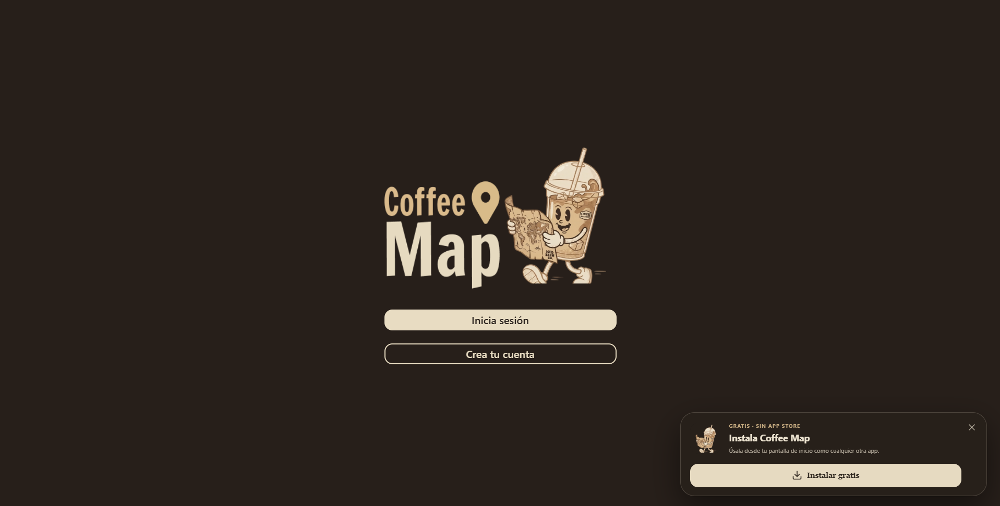
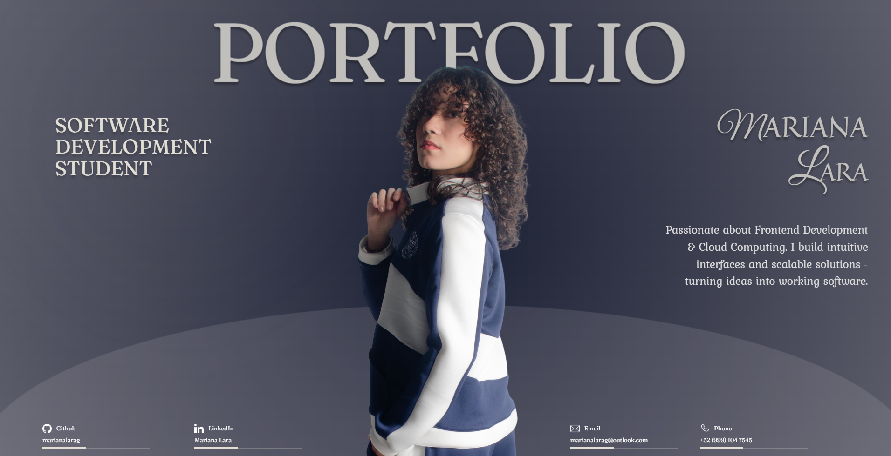

<!-- ═══════════════════════════════════════════════════════════════ -->
<!--                         MARIANA LARA                           -->
<!-- ═══════════════════════════════════════════════════════════════ -->

<div align="center">

# Hi, I'm Mariana Lara 

### Software Development Student · Frontend Developer · UX/UI

<br/>


<br/><br/>

[](https://marianalara.dev)
[](https://www.linkedin.com/in/marianalarag)
[](mailto:marianalarag@outlook.com)

</div>

<br/>

<!-- ══════════════════════ ABOUT ME ══════════════════════ -->

## About Me

> Hi! I'm **Mariana Lara**, a Software Development student focused on **Frontend Development and UX/UI Design**.
>
> I enjoy turning ideas and designs into intuitive, accessible and visually engaging digital experiences. I work with technologies such as **React, JavaScript, Tailwind CSS, Node.js and PostgreSQL**, combining development with user-centered design.
>
> I'm currently expanding my knowledge in **Cloud Computing** and **mobile development**, while continuing to build projects that allow me to explore new technologies and solve real-world problems.
>
> My goal is to create digital products that are not only functional, but also **simple, useful and enjoyable to use**.

<br/>

- **Currently focused on:** Frontend Development & UX/UI
- **Learning:** Cloud Computing & AWS
- **Exploring:** Mobile Development with Flutter & Capacitor
- **Interested in:** Accessible interfaces and user-centered design
- **Building:** Web and mobile experiences with real-world applications


<br/>

<!-- ══════════════════════ TECH STACK ══════════════════════ -->

## Tech Stack

<div align="center">

### Frontend


<br/>

### Backend & Databases


<br/>

### Mobile & Cloud


<br/>

### Design & Tools


<br/><br/>


</div>

<br/>

<!-- ══════════════════════ FEATURED PROJECTS ══════════════════════ -->

## Featured Projects

<!-- ══════════════════════ COFFEE MAP ══════════════════════ -->

<table width="100%">
<tr>

<td width="55%" valign="middle">

<a href="https://coffe-map-khaki.vercel.app/">
  
</a>

</td>

<td width="45%" valign="top">

### Coffee Map Mérida

A social platform for discovering, saving, reviewing and sharing coffee shops around **Mérida, Yucatán**.

- Interactive map focused on Mérida
- Favorites and visited coffee shops
- Personal coffee shop wishlist
- Ratings and personal reviews
- Community posts and photo galleries
- Administrative dashboard
- Authentication with Supabase
- Moderation and management tools
- PWA, Android & iOS architecture

<br/>


<br/><br/>

[](https://coffe-map-khaki.vercel.app/)

[](https://github.com/marianalarag/Coffe-Map)

</td>

</tr>
</table>

<br/>

<!-- ══════════════════════ PORTFOLIO ══════════════════════ -->

<table width="100%">
<tr>

<td width="45%" valign="top">

### Personal Portfolio

My personal website showcasing my journey as a **Software Development student**, along with my projects, technical skills and professional experience.

The design reflects my interest in combining **software development, visual design and user experience**.

- Custom UX/UI design
- Built with React
- Responsive interface
- Smooth visual experience
- Professional experience
- Featured software projects
- Personal developer branding

<br/>


<br/><br/>

[](https://marianalara.dev)

[](https://github.com/marianalarag/Portfolio)

</td>

<td width="55%" valign="middle">

<a href="https://marianalara.dev">
  
</a>

</td>

</tr>
</table>

<br/>

<!-- ══════════════════════ MORE PROJECTS ══════════════════════ -->

## More Projects

<table width="100%">

<tr>

<td width="50%" valign="top">

### JC Bikes

Full-stack e-commerce platform focused on bicycle products and online shopping.

- User authentication
- Product management
- Shopping experience
- Transactional email integration
- PostgreSQL database

<br/>


<br/><br/>

[](https://github.com/marianalarag/JC-Bikes)

</td>

<td width="50%" valign="top">

### Market App

Full-stack project created to explore authentication, APIs and product management.

- REST API
- JWT authentication
- User management
- Product management
- PostgreSQL database

<br/>


<br/><br/>

[](https://github.com/marianalarag/market-app)

</td>

</tr>

<tr>

<td width="50%" valign="top">

### Cine UX/UI

Cinema interface project focused on **frontend development and user experience**.

- Responsive interface
- Visual components
- UX/UI implementation
- Frontend development

<br/>


<br/><br/>

[](https://github.com/marianalarag/Cine-UX-UI)

</td>

<td width="50%" valign="top">

### Donut App

Mobile application developed while exploring **cross-platform mobile development with Flutter**.

- Mobile interface
- Flutter widgets
- Cross-platform development
- Backend integration

<br/>


<br/><br/>

[](https://github.com/marianalarag/donut_app_2a_lara)

</td>

</tr>

</table>

<br/>

<!-- ══════════════════════ EXPERIENCE ══════════════════════ -->

## Experience & Focus

<div align="center">

| Development | Design | Cloud |
|:---:|:---:|:---:|
| React & JavaScript | UX/UI Design | AWS |
| Responsive Interfaces | Figma Prototyping | Cloud Fundamentals |
| REST API Integration | Accessibility | Deployment |
| Full-Stack Projects | User-Centered Design | Supabase & Vercel |

</div>

<br/>

<!-- ══════════════════════ CURRENT GOALS ══════════════════════ -->

## Current Goals

```text
Create intuitive and accessible user experiences
Keep growing as a Frontend Developer
Strengthen my Cloud Computing knowledge
Explore cross-platform mobile development
Build products that solve real-world problems
```

<br/>

<!-- ══════════════════════ CONNECT ══════════════════════ -->

## Let's Connect

<div align="center">

I'm always interested in learning, collaborating and building new things.

<br/><br/>

[](https://marianalara.dev)
[](https://www.linkedin.com/in/marianalarag)
[](mailto:marianalarag@outlook.com)

<br/><br/>

### Thanks for visiting my profile! 💜

*"Designing experiences, building solutions and always learning."*

</div>
